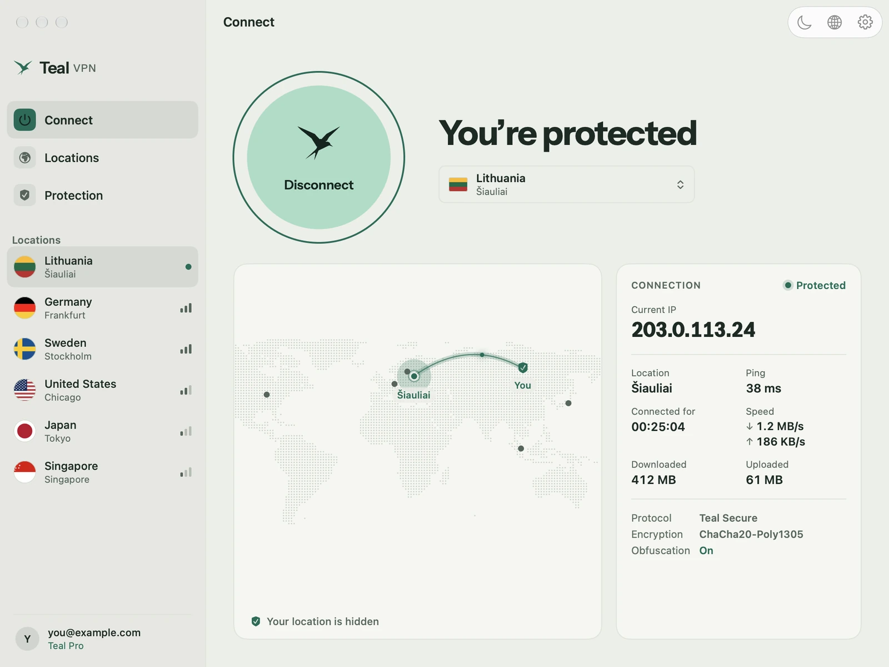
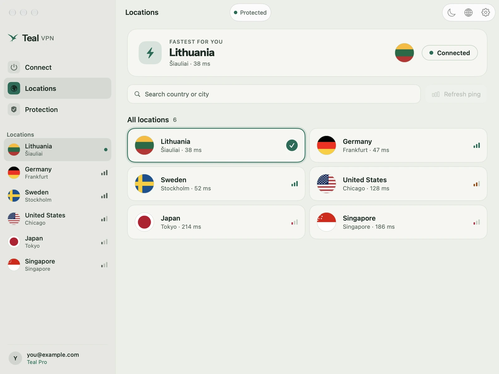
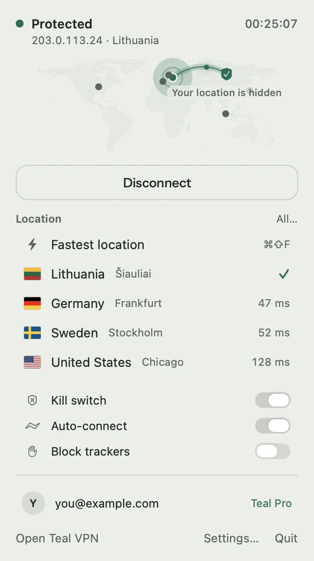

# Teal VPN for Mac

Teal VPN is a private VPN that is built to connect on networks that block VPNs. Teal Free gives you 500 MB every
day with no card and no ads. Teal Pro is unlimited and opens every location.

This page hosts the **direct download** of the Teal VPN app for Mac (a `.dmg` disk image), for macOS 14 or newer.
The app is signed with our Apple Developer ID and notarised by Apple. This repository holds no source code, only
the releases.

## Screenshots

  

## Download

**[Download the latest Teal VPN for Mac](https://github.com/tealvpn/mac/releases/latest/download/TealVPN.dmg)**

Every version is on the [Releases](https://github.com/tealvpn/mac/releases) page.

## Install

1. Open the downloaded `TealVPN.dmg`.
2. Drag **Teal VPN** to **Applications**, then open it from Applications.
3. Sign in and press **Connect**. The first time, macOS asks you to allow the Teal VPN system extension and the VPN
   configuration; the app shows the exact steps.

## Check the file (SHA-256)

Each release lists the file's SHA-256 and carries a `TealVPN.dmg.sha256` file. Compare it with your download:

- Mac: `shasum -a 256 -c TealVPN.dmg.sha256`
- Linux: `sha256sum -c TealVPN.dmg.sha256`

macOS also checks the Developer ID signature and the notarisation before the app opens. The app updates itself and
checks the SHA-256 and the signature before installing an update.

## Official links

- Website: https://tealvpn.com
- Mac: https://tealvpn.com/mac
- Your account: https://account.tealvpn.com
- Help: support@tealvpn.com

Download Teal VPN only from tealvpn.com or this page.
